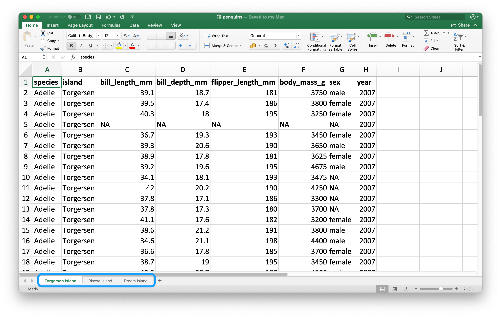
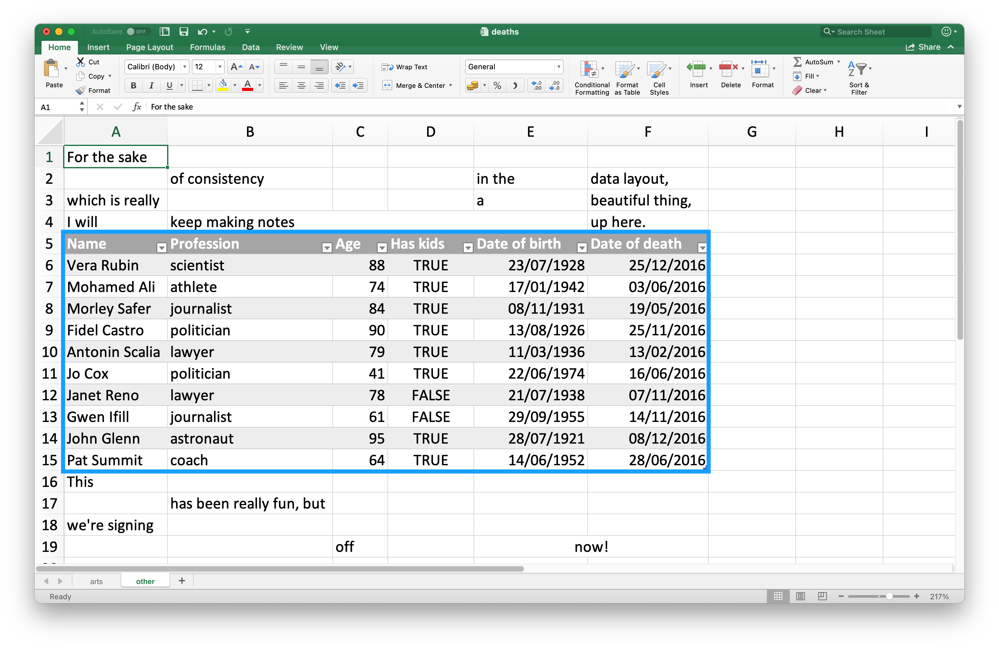
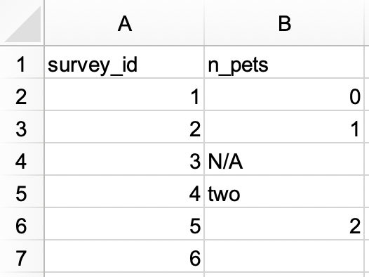
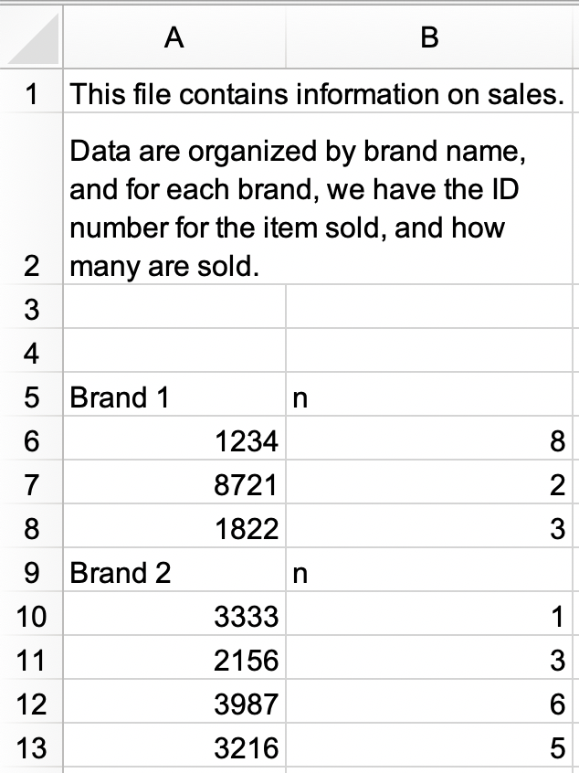

# Spreadsheets {#sec-import-spreadsheets}

```{r}
#| echo: false
source("_common.R")
```

## Introduction

在 @sec-data-import 中，你学习了如何从纯文本文件（如`.csv`和`.tsv`）导入数据。
现在是时候学习如何从电子表格（无论是Excel电子表格还是Google Sheets）中获取数据了。
这部分内容将建立在你在 @sec-data-import 中所学知识的基础上，但我们也将讨论处理电子表格数据时需要考虑的其他事项和复杂性。

如果你或你的合作者正在使用电子表格来组织数据，我们强烈推荐阅读Karl Broman和Kara Woo撰写的论文"Data Organization in Spreadsheets"：<https://doi.org/10.1080/00031305.2017.1375989>。
这篇论文中提出的最佳实践将为你后续将电子表格数据导入R进行分析和可视化时省去大量麻烦。

## Excel

Microsoft Excel是一款广泛使用的电子表格软件程序，数据被组织在电子表格文件内的工作表中。

### Prerequisites

在本节中，你将学习如何使用**readxl**包将Excel电子表格中的数据加载到R中。
这个包不属于tidyverse的核心包，因此你需要显式加载它，但当你安装tidyverse包时，它会被自动安装。
稍后，我们还将使用writexl包，它允许我们创建Excel电子表格。

```{r}
#| message: false

library(readxl)
library(tidyverse)
library(writexl)
```

### Getting started

readxl的大部分函数允许你将Excel电子表格加载到R中：

-   `read_xls()` 用于读取 `xls` 格式的Excel文件。
-   `read_xlsx()` 用于读取 `xlsx` 格式的Excel文件。
-   `read_excel()` 可以读取 `xls` 和 `xlsx` 两种格式的文件。它会根据输入自动判断文件类型。

这些函数的语法与我们之前介绍过的用于读取其他类型文件（例如 `read_csv()`、`read_table()` 等）的函数非常相似。
在本章的剩余部分，我们将重点介绍如何使用`read_excel()`。

### Reading Excel spreadsheets {#sec-reading-spreadsheets-excel}

@fig-students-excel 展示了我们将要读入R的电子表格在Excel中的样子。

```{r}
#| label: fig-students-excel
#| echo: false
#| fig-width: 5
#| fig-cap: |
#|   Excel 中名为 Students.xlsx 的电子表格。
#| fig-alt: |
#|   A look at the students spreadsheet in Excel. The spreadsheet contains 
#|   information on 6 students, their ID, full name, favourite food, meal plan, 
#|   and age.

knitr::include_graphics("screenshots/import-spreadsheets-students.png")
```

`read_excel()` 的第一个参数是要读取文件的路径。

```{r}
students <- read_excel("data/students.xlsx")
```

`read_excel()` 会将文件读取为tibble

```{r}
students
```

数据中包含六名学生和每个学生的五个变量。
然而，在这个数据集中，我们可能需要处理几个问题：

1.  列名格式不统一。
    你可以通过提供列名遵循一致的格式；我们推荐`snake_case`命名法使用 `col_names` 参数。

    ```{r}
    #| include: false

    options(
      dplyr.print_min = 7,
      dplyr.print_max = 7
    )
    ```

    ```{r}
    read_excel(
      "data/students.xlsx",
      col_names = c("student_id", "full_name", "favourite_food", "meal_plan", "age")
    )
    ```

    ```{r}
    #| include: false

    options(
      dplyr.print_min = 6,
      dplyr.print_max = 6
    )
    ```

    遗憾的是，这招并不完全奏效。
    虽然我们得到了想要的变量名，但之前作为标题行（表头）的内容现在却显示为数据中的第一条观测值。
    你可以使用 `skip` 参数来明确跳过那一行。

    ```{r}
    read_excel(
      "data/students.xlsx",
      col_names = c("student_id", "full_name", "favourite_food", "meal_plan", "age"),
      skip = 1
    )
    ```

2.  在 `favourite_food` 列中，有一个观测值是 `N/A`，它代表“不可用”（not available），但目前它并未被识别为 `NA`（请注意此处的 `N/A` 与列表中第四名学生年龄的对比）。
    你可以使用 `na` 参数来指定哪些字符串应被识别为 `NA`s。
    默认情况下，只有 `""`（空字符串，或者在从电子表格读取的情况下，指空单元格或包含公式 `=NA()` 的单元格）会被识别为 `NA`。

    ```{r}
    read_excel(
      "data/students.xlsx",
      col_names = c("student_id", "full_name", "favourite_food", "meal_plan", "age"),
      skip = 1,
      na = c("", "N/A")
    )
    ```

3.  另一个遗留问题是 `age`（年龄）被读取为字符型变量，但它本应是数值型。
    与用于从平面文件读取数据的 `read_csv()` 及其同类函数一样，你可以向 `read_excel()` 提供一个 `col_types` 参数，并指定所读取变量的列类型。
    不过，语法稍有不同。
    你可选的类型有：`"skip"`, `"guess"`, `"logical"`, `"numeric"`, `"date"`, `"text"` or `"list"`.

    ```{r}
    read_excel(
      "data/students.xlsx",
      col_names = c("student_id", "full_name", "favourite_food", "meal_plan", "age"),
      skip = 1,
      na = c("", "N/A"),
      col_types = c("numeric", "text", "text", "text", "numeric")
    )
    ```

    然而，这样操作也未能完全达到预期效果。
    通过指定 `age` 应为数值型，我们将那个包含非数字条目（值为 `five`）的单元格转换成了 `NA`。
    在这种情况下，我们应该先将 age 作为 `"text"` 读取进来，待数据加载到 R 中后再进行转换。

    ```{r}
    students <- read_excel(
      "data/students.xlsx",
      col_names = c("student_id", "full_name", "favourite_food", "meal_plan", "age"),
      skip = 1,
      na = c("", "N/A"),
      col_types = c("numeric", "text", "text", "text", "text")
    )

    students <- students |>
      mutate(
        age = if_else(age == "five", "5", age),
        age = parse_number(age)
      )

    students
    ```

我们花了多个步骤，通过反复试验才将数据加载成我们想要的精确格式，这并不出乎意料。
数据科学本身就是一个迭代的过程，而从电子表格读取数据时，这个迭代过程可能比处理其他纯文本、矩形数据文件更为繁琐，因为人们倾向于将数据输入到电子表格中，并不仅将其用于数据存储，还用于共享和交流。

在你加载数据并查看之前，你无法确切知道数据会是什么样子。
嗯，实际上有一种方法可以预先了解。
你可以在Excel中打开文件瞧一瞧。
如果你打算这样做，我们建议先复制一份Excel文件用于打开和交互式浏览，同时保留原始数据文件不动，并从这份未修改的文件中将数据读入R。
这样可以确保你在查看过程中不会意外地覆盖电子表格中的任何内容。
同时，你也不应畏惧我们在这里所做的事情：加载数据，查看一番，调整代码，再次加载，如此反复，直到你对结果满意为止。

### Reading worksheets

电子表格与平面文件的一个重要区别在于其包含多个工作表（worksheets）的概念。
@fig-penguins-islands 展示了一个包含多个工作表的Excel电子表格。
这些数据来自 **palmerpenguins** 包。
每个工作表包含来自不同数据收集岛屿的企鹅信息。

```{r}
#| label: fig-penguins-islands
#| echo: false
#| fig-cap: |
#|   Excel 中名为 penguins.xlsx 的电子表格包含三个工作表。
#| fig-alt: |
#|   A look at the penguins spreadsheet in Excel. The spreadsheet contains has 
#|   three worksheets: Torgersen Island, Biscoe Island, and Dream Island.


```

你可以使用 `read_excel()` 中的 `sheet` 参数从电子表格中读取单个工作表。
默认情况下（我们一直沿用至今），读取的是第一个工作表。

```{r}
read_excel("data/penguins.xlsx", sheet = "Torgersen Island")
```

由于字符串 `"NA"` 未被识别为真正的 `NA` 值，一些看似包含数值数据的变量会被读取为字符型。

```{r}
penguins_torgersen <- read_excel("data/penguins.xlsx", sheet = "Torgersen Island", na = "NA")

penguins_torgersen
```

另外，你也可以使用 `excel_sheets()` 来获取Excel电子表格中所有工作表的信息，然后读取你感兴趣的一个或多个。

```{r}
excel_sheets("data/penguins.xlsx")
```

一旦知道了工作表的名称，就可以使用 `read_excel()` 分别读取它们。

```{r}
penguins_biscoe <- read_excel("data/penguins.xlsx", sheet = "Biscoe Island", na = "NA")
penguins_dream  <- read_excel("data/penguins.xlsx", sheet = "Dream Island", na = "NA")
```

在这个例子中，完整的企鹅数据集分布在电子表格的三个工作表中。
每个工作表具有相同的列数，但行数不同。

```{r}
dim(penguins_torgersen)
dim(penguins_biscoe)
dim(penguins_dream)
```

我们可以使用 `bind_rows()` 将它们合并在一起。

```{r}
penguins <- bind_rows(penguins_torgersen, penguins_biscoe, penguins_dream)
penguins
```

在 @sec-iteration 中，我们将讨论如何以更简洁的代码完成此类任务，避免重复编写。

### Reading part of a sheet

由于许多人将Excel电子表格既用于数据展示也用于数据存储，因此经常发现电子表格中的某些单元格内容并非你想要读入R的数据的一部分。
@fig-deaths-excel 展示了这样一个电子表格：工作表中间看起来像一个数据框，但数据上下的单元格中却存在无关的文本。

```{r}
#| label: fig-deaths-excel
#| echo: false
#| fig-cap: |
#|   Excel 中名为“death.xlsx”的电子表格。
#| fig-alt: |
#|   A look at the deaths spreadsheet in Excel. The spreadsheet has four rows 
#|   on top that contain non-data information; the text 'For the same of 
#|   consistency in the data layout, which is really a beautiful thing, I will 
#|   keep making notes up here.' is spread across cells in these top four rows. 
#|   Then, there is a data frame that includes information on deaths of 10 
#|   famous people, including their names, professions, ages, whether they have 
#|   kids or not, date of birth and death. At the bottom, there are four more 
#|   rows of non-data information; the text 'This has been really fun, but 
#|   we're signing off now!' is spread across cells in these bottom four rows.


```

这个电子表格是readxl包提供的示例电子表格之一。
你可以使用 `readxl_example()` 函数在你的系统上定位该电子表格在包安装目录中的位置。
这个函数会返回电子表格的路径，你可以像往常一样在 `read_excel()` 中使用该路径。

```{r}
deaths_path <- readxl_example("deaths.xlsx")
deaths <- read_excel(deaths_path)
deaths
```

最上面三行和最下面四行不属于数据框的一部分。
可以使用 `skip` 和 `n_max` 参数来排除这些无关的行，但我们更推荐使用单元格区域。
在Excel中，左上角的单元格是 `A1`。
当您向右移动列时，单元格标签会按字母顺序变化，即 `B1`, `C1` 等。
而当您向下移动行时，单元格标签中的数字会增加，即 `A2`, `A3` 等。

这里，我们想要读取的数据起始于单元格 `A5`，结束于单元格 `F15`。
在电子表格表示法中，这即 `A5:F15`，我们将其提供给 `range` 参数：

```{r}
read_excel(deaths_path, range = "A5:F15")
```

### Data types

在CSV文件中，所有值都是字符串。
这对数据本身来说并不完全真实，但它很简单：一切都是字符串。

Excel电子表格中的底层数据则更为复杂。
一个单元格可以是以下四种类型之一：

-   A boolean, 例如 `TRUE`, `FALSE`, 或 `NA`.

-   A number, 例如 "10" 或 "10.5".

-   A datetime, 也可以包含时间，例如 "11/1/21" 或 "11/1/21 3:00 PM".

-   A text string, 例如 "ten".

处理电子表格数据时，务必记住底层数据可能与您在单元格中看到的截然不同。
例如，Excel没有整数的概念。
所有数字都存储为浮点数，但您可以选择以自定义小数位数显示数据。
类似地，日期实际上存储为数字，具体来说是自1970年1月1日以来的秒数。
您可以通过在Excel中应用格式来自定义日期的显示方式。
令人困惑的是，也可能存在看起来像数字但实际上是字符串的情况（例如，在Excel的单元格中输入 `'10`）。

底层数据存储方式与数据显示方式之间的这些差异，可能会导致数据加载到R时出现意外情况。
默认情况下，readxl会猜测给定列的数据类型。
一个推荐的工作流程是让readxl猜测列类型，确认您对猜测的列类型是否满意，如果不满意，则返回并重新导入，同时指定 `col_types`，如 @sec-reading-spreadsheets-excel 所示。

另一个挑战是当您的Excel电子表格中有一列混合了这些类型时，例如，某些单元格是数字，其他是文本，还有一些是日期。
在将数据导入R时，readxl必须做出一些决定。在
这些情况下，您可以将此列的类型设置为 `"list"`，这将把该列加载为一个长度为1的向量列表，其中每个向量元素的类型是被猜测出来的。

::: callout-note
有时数据以更特殊的方式存储，例如单元格背景的颜色，或者文本是否为粗体。
在这种情况下，您可能会发现 [tidyxl package](https://nacnudus.github.io/tidyxl/) 包 很有用。
有关处理来自Excel的非表格数据策略的更多信息，请参阅 <https://nacnudus.github.io/spreadsheet-munging-strategies/>。
:::

### Writing to Excel {#sec-writing-to-excel}

让我们创建一个可以随后写入文件的小型数据框。
请注意，`item` 是一个因子型变量，`quantity` 是一个整型变量。

```{r}
bake_sale <- tibble(
  item     = factor(c("brownie", "cupcake", "cookie")),
  quantity = c(10, 5, 8)
)

bake_sale
```

你可以使用 [writexl package](https://docs.ropensci.org/writexl/) 中的 `write_xlsx()` 函数将数据写回磁盘，保存为Excel文件：

```{r}
#| eval: false

write_xlsx(bake_sale, path = "data/bake-sale.xlsx")
```

@fig-bake-sale-excel 展示了该数据在Excel中的样子。
请注意，列名已被包含在内并设置为粗体。
这可以通过将 `col_names` 和 `format_headers` 参数设置为 `FALSE` 来关闭。

```{r}
#| label: fig-bake-sale-excel
#| echo: false
#| fig-width: 5
#| fig-cap: |
#|   Excel 中名为“bake_sale.xlsx”的电子表格。
#| fig-alt: |
#|   Bake sale data frame created earlier in Excel.

knitr::include_graphics("screenshots/import-spreadsheets-bake-sale.png")
```

就像从CSV读取数据一样，当我们重新读回这个Excel文件时，数据类型信息会丢失。
这使得Excel文件也不适合用于缓存中间结果。
关于其他替代方案，请参见 @sec-writing-to-a-file。

```{r}
read_excel("data/bake-sale.xlsx")
```

### Formatted output

writexl 包是写入简单 Excel 电子表格的轻量级解决方案，但如果你需要更多功能，例如在工作簿内的多个工作表写入数据或进行样式设置，那么你可能需要使用 [openxlsx package](https://ycphs.github.io/openxlsx) 包。
我们在此不深入探讨该包的使用细节，但如果你想了解如何使用openxlsx将从R导出的数据写入Excel并进行更多格式设置，我们推荐阅读其官方文档<https://ycphs.github.io/openxlsx/articles/Formatting.html>。

请注意，这个包并不属于tidyverse，因此其函数和工作流程可能会让你感到不太熟悉。
例如，函数名采用驼峰式命名（camelCase），多个函数不能通过管道符组合使用，而且参数的排列顺序也与tidyverse的习惯不同。
不过，这很正常。
随着你在本书之外进一步学习和使用R，你会遇到各种各样的R包，它们为了实现特定目标而采用了不同的编程风格。
熟悉一个新包编码风格的好方法是：运行函数文档中提供的示例，以感受其语法和输出格式；同时阅读该包可能附带的任何 vignette。

### Exercises

1.  在一个 Excel 文件中，创建以下数据集并将其保存为 `survey.xlsx`。
    或者，你也可以从此处下载该 Excel 文件 [here](https://docs.google.com/spreadsheets/d/1yc5gL-a2OOBr8M7B3IsDNX5uR17vBHOyWZq6xSTG2G8)。

    ```{r}
    #| echo: false
    #| fig-width: 4
    #| fig-alt: |
    #|   A spreadsheet with 3 columns (group, subgroup, and id) and 12 rows. 
    #|   The group column has two values: 1 (spanning 7 merged rows) and 2 
    #|   (spanning 5 merged rows). The subgroup column has four values: A 
    #|   (spanning 3 merged rows), B (spanning 4 merged rows), A (spanning 2 
    #|   merged rows), and B (spanning 3 merged rows). The id column has twelve 
    #|   values, numbers 1 through 12.

    
    ```

    然后，将其读入 R，并将 `survey_id` 指定为字符变量，`n_pets` 指定为数值变量。

    ```{r}
    #| echo: false

    read_excel("data/survey.xlsx", na = c("", "N/A"), col_types = c("text", "text")) |>
      mutate(
        n_pets = case_when(
          n_pets == "none" ~ "0",
          n_pets == "two"  ~ "2",
          TRUE             ~ n_pets
        ),
        n_pets = as.numeric(n_pets)
      )
    ```

2.  在另一个 Excel 文件中，创建以下数据集并将其保存为 `roster.xlsx`。
    或者，你也可以从此处下载该 Excel 文件 [here](https://docs.google.com/spreadsheets/d/1LgZ0Bkg9d_NK8uTdP2uHXm07kAlwx8-Ictf8NocebIE)。

    ```{r}
    #| echo: false
    #| fig-width: 4
    #| fig-alt: |
    #|   A spreadsheet with 3 columns (group, subgroup, and id) and 12 rows. The 
    #|   group column has two values: 1 (spanning 7 merged rows) and 2 (spanning 
    #|   5 merged rows). The subgroup column has four values: A (spanning 3 merged 
    #|   rows), B (spanning 4 merged rows), A (spanning 2 merged rows), and B 
    #|   (spanning 3 merged rows). The id column has twelve values, numbers 1 
    #|   through 12.

    knitr::include_graphics("screenshots/import-spreadsheets-roster.png")
    ```

    然后，将其读入 R。
    生成的数据框应命名为 `roster`，并且看起来像下面这样。

    ```{r}
    #| echo: false
    #| message: false

    read_excel("data/roster.xlsx") |>
      fill(group, subgroup) |>
      print(n = 12)
    ```

3.  在一个新的 Excel 文件中，创建以下数据集并将其保存为 `sales.xlsx`。
    或者，你也可以从此处下载该 Excel 文件 [here](https://docs.google.com/spreadsheets/d/1oCqdXUNO8JR3Pca8fHfiz_WXWxMuZAp3YiYFaKze5V0)。

    ```{r}
    #| echo: false
    #| fig-alt: |
    #|   A spreadsheet with 2 columns and 13 rows. The first two rows have text 
    #|   containing information about the sheet. Row 1 says "This file contains
    #|   information on sales". Row 2 says "Data are organized by brand name, and 
    #|   for each brand, we have the ID number for the item sold, and how many are 
    #|   sold.". Then there are two empty rows, and then 9 rows of data.

    
    ```

    a\.
    读取 `sales.xlsx` 文件并将其保存为 `sales`。
    该数据框应如下所示，包含 `id` 和 `n` 作为列名，并且有 9 行数据。

    ```{r}
    #| echo: false
    #| message: false

    read_excel("data/sales.xlsx", skip = 3, col_names = c("id", "n")) |>
      print(n = 9)
    ```

    b\.
    进一步修改 `sales`，使其成为如下整洁的格式，包含三列（`brand`、`id` 和 `n`）以及 7 行数据。
    请注意，`id` 和 `n` 是数值型，`brand` 是字符型变量。

    ```{r}
    #| echo: false
    #| message: false

    read_excel("data/sales.xlsx", skip = 3, col_names = c("id", "n")) |>
      mutate(brand = if_else(str_detect(id, "Brand"), id, NA)) |>
      fill(brand) |>
      filter(n != "n") |>
      relocate(brand) |>
      mutate(
        id = as.numeric(id),
        n = as.numeric(n)
      ) |>
      print(n = 7)
    ```

4.  重新创建 `bake_sale` 数据框，并使用 openxlsx 包中的 `write.xlsx()` 函数将其写入一个 Excel 文件。

5.  在 @sec-data-import 中，你学习了使用 `janitor::clean_names()` 函数将列名转换为蛇形命名法（snake case）。
    读取我们本节前文介绍的 `students.xlsx` 文件，并使用此函数来“清洗”列名。

6.  如果你尝试用 `read_xls()` 读取一个扩展名为 `.xlsx` 的文件，会发生什么？

## Google Sheets

Google Sheets 是另一种广泛使用的电子表格程序。
它是免费的，并且基于网页运行。
与 Excel 一样，在 Google Sheets 中，数据也组织在电子表格文件内的工作表（也称为 sheets）中。

### Prerequisites

本节同样聚焦于电子表格，但这次你将使用 **googlesheets4** 包从 Google Sheet 加载数据。
这个包同样不属于 tidyverse 核心包，你需要显式加载它。

```{r}
library(googlesheets4)
library(tidyverse)
```

关于这个包的名称有个简短说明：googlesheets4 使用了 [Sheets API v4](https://developers.google.com/sheets/api/) 来提供 R 与 Google Sheets 的接口，因此得名。

### Getting started

googlesheets4 包的主要函数是 `read_sheet()`，它通过 URL 或文件 ID 读取 Google Sheet。
这个函数还有一个名称是 `range_read()`。

你也可以使用 `gs4_create()` 创建一个全新的 sheet，或者使用 `sheet_write()` 及相关函数写入一个已有的 sheet。

在本节中，我们将使用与 Excel 部分相同的数据集，以突出从 Excel 和 Google Sheets 读取数据的工作流程之间的异同。
readxl 和 googlesheets4 包都旨在模拟 readr 包的功能，你在 @sec-data-import 中已经见过 readr 包提供的 `read_csv()` 函数。
因此，许多任务只需简单地将 `read_excel()` 替换为 `read_sheet()` 即可完成。
但是，你也会发现 Excel 和 Google Sheets 的行为方式并非完全相同，因此其他任务可能需要对函数调用做进一步调整。

### Reading Google Sheets

@fig-students-googlesheets 展示了我们将要读入 R 的电子表格在 Google Sheets 中的样子。
这与 @fig-students-excel 中的是同一数据集，只是它存储在 Google Sheet 而非 Excel 中。

```{r}
#| label: fig-students-googlesheets
#| echo: false
#| fig-cap: |
#|   Google Sheet called students in a browser window.
#| fig-alt: |
#|   A look at the students spreadsheet in Google Sheets. The spreadsheet contains 
#|   information on 6 students, their ID, full name, favourite food, meal plan, 
#|   and age.

knitr::include_graphics("screenshots/import-googlesheets-students.png")
```

`read_sheet()` 的第一个参数是要读取文件的 URL，它会返回一个 tibble：\
<https://docs.google.com/spreadsheets/d/1V1nPp1tzOuutXFLb3G9Eyxi3qxeEhnOXUzL5_BcCQ0w>.
这些 URLs 使用起来不太方便，因此你通常更希望通过其 ID 来标识一个 sheet。

```{r}
#| include: false

gs4_deauth()
```

```{r}
#students_sheet_id <- "1V1nPp1tzOuutXFLb3G9Eyxi3qxeEhnOXUzL5_BcCQ0w"
#students <- read_sheet(students_sheet_id)
#students
```

就像我们对 `read_excel()` 所做的那样，我们可以向 `read_sheet()` 提供列名、NA 字符串以及列类型。

```{r}
#students <- read_sheet(
#  students_sheet_id,
#  col_names = c("student_id", "full_name", "favourite_food", "meal_plan", #"age"),
#  skip = 1,
#  na = c("", "N/A"),
#  col_types = "dcccc"
#)

#students
```

请注意，我们在这里定义列类型的方式略有不同，使用了简短代码。
例如，"dcccc" 代表 "double, character, character, character, character"。

从 Google Sheets 中读取单个工作表也是可行的。
让我们从 [penguins Google Sheet](https://pos.it/r4ds-penguins) 中读取 "Torgersen Island" 工作表：

```{r}
#penguins_sheet_id <- "1aFu8lnD_g0yjF5O-K6SFgSEWiHPpgvFCF0NY9D6LXnY"
#read_sheet(penguins_sheet_id, sheet = "Torgersen Island")
```

你可以使用 `sheet_names()` 获取 Google Sheet 中所有工作表的列表：

```{r}
#sheet_names(penguins_sheet_id)
```

最后，与 `read_excel()` 类似，我们可以通过在 `read_sheet()` 中定义 `range` 参数来读取 Google Sheet 的一部分。
请注意，我们在下面也使用了 `gs4_example()` 函数来定位 googlesheets4 包自带的一个示例 Google Sheet。

```{r}
#deaths_url <- gs4_example("deaths")
#deaths <- read_sheet(deaths_url, range = "A5:F15")
#deaths
```

### Writing to Google Sheets

你可以使用 `write_sheet()` 将数据从 R 写入 Google Sheets。
第一个参数是要写入的数据框，第二个参数是要写入的 Google Sheet 的名称（或其他标识符）：

```{r}
#| eval: false

write_sheet(bake_sale, ss = "bake-sale")
```

如果你想要将数据写入 Google Sheet 内的特定工作表，也可以通过 `sheet` 参数来指定。

```{r}
#| eval: false

write_sheet(bake_sale, ss = "bake-sale", sheet = "Sales")
```

### Authentication

虽然你无需通过 Google 账户验证即可读取公开的 Google Sheet，但读取私有 sheet 或写入 sheet 则需要验证，以便 googlesheets4 能够查看和管理你的 Google Sheets。

当你尝试读取需要验证的 sheet 时，googlesheets4 会引导你打开网页浏览器，提示你登录 Google 账户并授予其代表你操作 Google Sheets 的权限。
然而，如果你想指定特定的 Google 账户、验证范围等，可以使用 `gs4_auth()` 来实现，例如 `gs4_auth(email = "mine@example.com")`，这将强制使用与特定电子邮件关联的令牌。
有关验证的更多细节，我们建议阅读 googlesheets4 验证插文的文档： <https://googlesheets4.tidyverse.org/articles/auth.html>.

### Exercises

1.  从本章前文的 Excel 和 Google Sheets 中读取 `students` 数据集，在调用 `read_excel()` 和 `read_sheet()` 函数时不提供任何额外参数。
    在 R 中得到的数据框完全相同吗？
    如果不是，它们有何不同？

2.  从 <https://pos.it/r4ds-survey> 读取名为 survey 的 Google Sheet，并将 `survey_id` 指定为字符变量，`n_pets` 指定为数值变量。

3.  从 <https://pos.it/r4ds-roster> 读取名为 roster 的 Google Sheet。
    生成的数据框应命名为 `roster`，并且看起来像下面这样。

    ```{r}
    #| echo: false
    #| message: false

    #    read_sheet("https://docs.google.com/spreadsheets/d/1LgZ0Bkg9d_NK8uTdP2uHXm07kAlwx8-Ictf8NocebIE/") |>
    #      fill(group, subgroup) |>
    #      print(n = 12)
    ```

## Summary

Microsoft Excel 和 Google Sheets 是两个最流行的电子表格系统。
能够直接从 R 中与存储在 Excel 和 Google Sheets 文件中的数据进行交互，是一项强大的技能！
在本章中，你学习了如何使用 readxl 包中的 `read_excel()` 函数将 Excel 电子表格中的数据读入 R，以及如何使用 googlesheets4 包中的 `read_sheet()` 函数将 Google Sheets 中的数据读入 R。
这些函数的工作方式非常相似，并且具有相似的参数，用于指定列名、NA 字符串、要跳过的文件顶部行数等。
此外，这两个函数都可以从电子表格中读取单个工作表。

另一方面，写入 Excel 文件需要使用不同的包和函数（`writexl::write_xlsx()`），而你可以使用 googlesheets4 包中的 `write_sheet()` 函数写入 Google Sheet。

在下一章中，你将学习一个不同的数据源以及如何将该数据源中的数据读入R：数据库。
