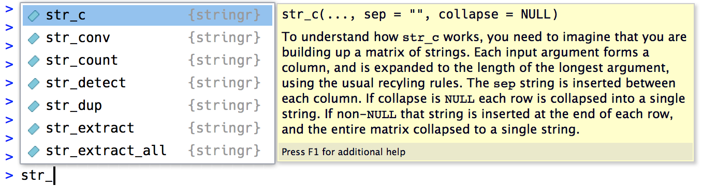

# Strings {#sec-strings}

```{r}
#| echo: false
source("_common.R")
```

## Introduction

到目前为止，您已使用过大量字符串却未深入了解其细节。
现在我们将深入探索字符串的本质特性，并掌握一些强大的字符串处理工具。

首先我们将详细介绍创建字符串和字符向量的方法。
接着学习如何从数据中生成字符串，以及反过来如何从数据中提取字符串。
随后我们将探讨处理单个字母的工具。
本章最后将介绍针对单个字母操作的函数，并简要讨论英语使用习惯在处理其他语言时可能导致的认知偏差。

下一章我们将继续研究字符串，届时您将深入了解正则表达式的强大功能。

### Prerequisites

本章我们将使用 stringr 包中的函数，该包是核心 tidyverse 的组成部分。
我们还会使用 babynames 数据集，因为它提供了一些有趣的字符串供我们操作。

```{r}
#| label: setup
#| message: false

library(tidyverse)
library(babynames)
```

您可以快速识别何时在使用 stringr 函数，因为所有 stringr 函数都以 `str_` 开头。
如果您使用 RStudio，这个特性尤其有用，因为输入 `str_` 会触发自动补全功能，帮助您回忆可用的函数。

```{r}
#| echo: false
#| fig-alt: |
#|   str_c typed into the RStudio console with the autocomplete tooltip shown 
#|   on top, which lists functions beginning with str_c. The funtion signature 
#|   and beginning of the man page for the highlighted function from the 
#|   autocomplete list are shown in a panel to its right.


```

## Creating a string

本书前面曾顺带创建过字符串但未讨论细节。
首先可以使用单引号（`'`）或双引号（`"`）创建字符串。
两者行为并无差异，根据一致性原则，[tidyverse style guide](https://style.tidyverse.org/syntax.html#character-vectors) 建议使用 `"`，除非字符串本身包含多个 `"`。

```{r}
string1 <- "This is a string"
string2 <- 'If I want to include a "quote" inside a string, I use single quotes'
```

如果忘记闭合引号，你会看到 `+` 这个续行提示符：

```         
> "This is a string without a closing quote
+ 
+ 
+ HELP I'M STUCK IN A STRING
```

若遇到这种情况且无法判断该闭合哪个引号，请按 Esc 键取消操作后重试。

### Escapes

要在字符串中包含原义的单引号或双引号，可使用反斜杠 `\` 进行转义：

```{r}
double_quote <- "\"" # or '"'
single_quote <- '\'' # or "'"
```

因此若需要在字符串中包含原义的反斜杠，则必须对其进行转义：`"\\"`：

```{r}
backslash <- "\\"
```

请注意字符串的打印显示结果与其实际内容不同，因为打印显示会呈现转义符（换句话说，当打印字符串时，你可以复制粘贴输出内容来重建该字符串）。
To see the raw contents of the string, use `str_view()`[^strings-1]: 要查看字符串的原始内容，请使用 `str_view()`[^strings-2]：

[^strings-1]: 或使用 base R 函数 `writeLines()`。

[^strings-2]: 或使用 base R 函数 `writeLines()`。

```{r}
x <- c(single_quote, double_quote, backslash)
x

str_view(x)
```

### Raw strings {#sec-raw-strings}

创建包含多个引号或反斜杠的字符串会很快变得令人困惑。
为了说明这个问题，我们创建一个包含定义 `double_quote` 和 `single_quote` 变量代码块内容的字符串：

```{r}
tricky <- "double_quote <- \"\\\"\" # or '\"'
single_quote <- '\\'' # or \"'\""
str_view(tricky)
```

这里出现了大量反斜杠！
（这种情况有时被称为 [leaning toothpick syndrome](https://en.wikipedia.org/wiki/Leaning_toothpick_syndrome)。）要避免转义，可以使用原始字符串[^strings-3]：

[^strings-3]: 在 R 4.0.0 及以上版本获取.

```{r}
tricky <- r"(double_quote <- "\"" # or '"'
single_quote <- '\'' # or "'")"
str_view(tricky)
```

原始字符串通常以 `r"(` 开头，以 `)"` 结尾。
但如果字符串包含 `)"`，则可以改用 `r"[]"` 或 `r"{}"`，若仍不足以处理，还可以插入任意数量的破折号使起始和结束标记唯一，例如 `` `r"--()--" ``、`` `r"---()---" `` 等。原始字符串的灵活性足以处理任何文本。

### Other special characters

除了 `\"`、`\'` 和 `\\` 之外，还有一些其他可能用到的特殊字符。 最常见的是`\n`（换行符）和`\t`（制表符）。 有时你还会看到以`\u`或`\U`开头的Unicode转义字符串。 这是一种可在所有系统中编写非英文字符的方法。 你可以在`?Quotes`中查看其他特殊字符的完整列表。

```{r}
x <- c("one\ntwo", "one\ttwo", "\u00b5", "\U0001f604")
x
str_view(x)
```

请注意，`str_view()` 使用蓝色背景来显示制表符以便更容易识别。
处理文本时的挑战之一在于空白字符可能存在多种表现形式，这种背景色有助于您察觉异常情况。

### Exercises

1.  创建包含以下值的字符串：

    1.  `He said "That's amazing!"`

    2.  `\a\b\c\d`

    3.  `\\\\\\`

2.  在你的 R 会话中创建该字符串并打印。
    特殊字符 "\\u00a0" 会如何显示？
    `str_view()` 会如何呈现它？
    你能通过搜索查到这个特殊字符的含义吗？

    ```{r}
    x <- "This\u00a0is\u00a0tricky"
    ```

## Creating many strings from data

现在你已学会手动创建字符串的基础知识，接下来我们将详细探讨如何基于其他字符串生成新字符串。
这将帮助你解决一个常见问题：如何将自编文本与数据框中的字符串组合。
例如，你可以将 "Hello" 与 `name` 变量结合来创建问候语。
我们将演示如何使用 `str_c()` 和 `str_glue()` 实现这一功能，以及如何将它们 `mutate()` 结合使用。
这自然引出了关于哪些字符串函数可与 `summarize()` 配合使用的问题，因此本节最后将讨论字符串的汇总函数 `str_flatten()`。

### `str_c()`

`str_c()` 可接受任意数量的向量作为参数，并返回一个字符向量：

```{r}
str_c("x", "y")
str_c("x", "y", "z")
str_c("Hello ", c("John", "Susan"))
```

`str_c()` 与基础的 `paste0()` 非常相似，但遵循 tidyverse 的循环和缺失值传递规则，专为与 `mutate()` 配合使用而设计：

```{r}
df <- tibble(name = c("Flora", "David", "Terra", NA))
df |> mutate(greeting = str_c("Hi ", name, "!"))
```

若希望以其他方式显示缺失值，可使用 `coalesce()` 进行替换。根
据具体需求，可选择在 `str_c()` 内部或外部使用：

```{r}
df |> 
  mutate(
    greeting1 = str_c("Hi ", coalesce(name, "you"), "!"),
    greeting2 = coalesce(str_c("Hi ", name, "!"), "Hi!")
  )
```

### `str_glue()` {#sec-glue}

如果你使用 `str_c()` 混合许多固定字符串和变量字符串，会发现需要输入大量 `"`，导致代码整体目标难以看清。 [glue package](https://glue.tidyverse.org) 通过`str_glue()`[^strings-4]提供了另一种解决方案：只需输入一个具有特殊功能的字符串——任何在 `{}` 内的内容都会像在引号外一样被解析执行：

[^strings-4]: 如果你没有使用 stringr，也可以直接通过`glue::glue()`调用该功能。

```{r}
df |> mutate(greeting = str_glue("Hi {name}!"))
```

如你所见，`str_glue()` 目前会将缺失值转换为 `"NA"` 字符串，这不幸地导致了与`str_c()` 的不一致。

你可能也好奇如果需要在字符串中包含常规的`{`或`}`时会发生什么。
如果你猜测需要以某种方式转义它们，那么你的思路是正确的。
技巧在于glue采用了略微不同的转义技术：不是使用像`\`这样的特殊字符作为前缀，而是将特殊字符加倍：

```{r}
df |> mutate(greeting = str_glue("{{Hi {name}!}}"))
```

### `str_flatten()`

`str_c()` 和 `str_glue()` 与 `mutate()` 配合良好，因为它们的输出长度与输入相同。
如果你需要适用于 `summarize()` 的函数，即总是返回单个字符串？
这就是`str_flatten()`[^strings-5]的功能：它接收字符向量并将向量的每个元素组合成单个字符串：

[^strings-5]: base R 中的等效函数是带有`collapse`参数的`paste()`函数。

```{r}
str_flatten(c("x", "y", "z"))
str_flatten(c("x", "y", "z"), ", ")
str_flatten(c("x", "y", "z"), ", ", last = ", and ")
```

这使得它能与 `summarize()` 良好配合：

```{r}
df <- tribble(
  ~ name, ~ fruit,
  "Carmen", "banana",
  "Carmen", "apple",
  "Marvin", "nectarine",
  "Terence", "cantaloupe",
  "Terence", "papaya",
  "Terence", "mandarin"
)
df |>
  group_by(name) |> 
  summarize(fruits = str_flatten(fruit, ", "))
```

### Exercises

1.  比较以下输入中 `paste0()` 与 `str_c()` 的结果差异：

    ```{r}
    #| eval: false

    str_c("hi ", NA)
    str_c(letters[1:2], letters[1:3])
    ```

2.  `paste()` 和 `paste0()` 有什么区别？
    如何用 `str_c()` 实现与 `paste()` 等效的功能？

3.  将下列表达式在 `str_c()` 和 `str_glue()` 之间进行转换：

    a.  `str_c("The price of ", food, " is ", price)`

    b.  `str_glue("I'm {age} years old and live in {country}")`

    c.  `str_c("\\section{", title, "}")`

## Extracting data from strings

将多个变量压缩到单个字符串中的情况十分常见。
在本节中，您将学习使用四个 tidyr 函数来提取这些变量：

-   `df |> separate_longer_delim(col, delim)`
-   `df |> separate_longer_position(col, width)`
-   `df |> separate_wider_delim(col, delim, names)`
-   `df |> separate_wider_position(col, widths)`

仔细观察可以发现这里存在通用模式：`separate_`，接着 `longer` 或 `wider`，然后 `_`，最后是 `delim` 或 `position`。
这是因为这四个函数由两个更简单的基础操作组合而成：

-   与 `pivot_longer()` 和 `pivot_wider()` 类似，`_longer` 函数通过创建新行使输入数据框变长，而 `_wider` 函数通过生成新列使输入数据框变宽。
-   `delim` 使用分隔符（如 `", "` 或 `" "`）拆分字符串；`position` 按指定宽度进行分割，如`c(3, 5, 2)`。

我们将在 @sec-regular-expressions 讨论该函数家族的最后一个成员 `separate_wider_regex()`。
它是 `wider` 函数中最灵活的，但需要先了解正则表达式才能使用。

接下来两节将介绍这些 separate 函数的基本原理，先讲解拆分为行（相对简单），再讲解拆分为列。
最后我们将讨论 `wider` 函数提供的诊断问题工具。

### Separating into rows

当每行的组成部分数量不一致时，将字符串拆分为行往往最为实用。
最常见的情况是需要使用 `separate_longer_delim()` 根据分隔符进行拆分：

```{r}
df1 <- tibble(x = c("a,b,c", "d,e", "f"))
df1 |> 
  separate_longer_delim(x, delim = ",")
```

在实际应用中 `separate_longer_position()` 较为少见，但一些旧数据集确实会采用非常紧凑的格式，每个字符都被用来记录一个值：

```{r}
df2 <- tibble(x = c("1211", "131", "21"))
df2 |> 
  separate_longer_position(x, width = 1)
```

### Separating into columns {#sec-string-columns}

当每个字符串包含固定数量的组成部分且需要将其展开为列时，将字符串拆分为列最为实用。
这比对应的 `longer` 函数稍复杂些，因为需要为列命名。
例如在以下数据集中，`x` 由代码、版本号和年份组成，以`"."`分隔。
使用 `separate_wider_delim()` 时，我们需要在两个参数中分别指定分隔符和列名：

```{r}
df3 <- tibble(x = c("a10.1.2022", "b10.2.2011", "e15.1.2015"))
df3 |> 
  separate_wider_delim(
    x,
    delim = ".",
    names = c("code", "edition", "year")
  )
```

如果某个特定片段不需要，可以使用 `NA` 名称将其从结果中省略：

```{r}
df3 |> 
  separate_wider_delim(
    x,
    delim = ".",
    names = c("code", NA, "year")
  )
```

`separate_wider_position()` 的工作方式略有不同，因为通常需要指定每列的宽度。
因此需要提供一个命名的整数向量，其中名称表示新列的名称，值表示该列占据的字符数。
通过不命名某些值可以将其从输出中省略：

```{r}
df4 <- tibble(x = c("202215TX", "202122LA", "202325CA")) 
df4 |> 
  separate_wider_position(
    x,
    widths = c(year = 4, age = 2, state = 2)
  )
```

### Diagnosing widening problems

`separate_wider_delim()`[^strings-6] 要求固定且已知的列数。
如果某些行没有预期数量的片段会发生什么？
可能存在两种问题：片段过少或过多，因此 `separate_wider_delim()` 提供了两个参数来帮助处理：`too_few` 和 `too_many`。 我们首先通过以下示例数据集看看 `too_few` 的情况：

[^strings-6]: 同样原则适用于 `separate_wider_position()` 和 `separate_wider_regex()`。

```{r}
#| error: true
df <- tibble(x = c("1-1-1", "1-1-2", "1-3", "1-3-2", "1"))

df |> 
  separate_wider_delim(
    x,
    delim = "-",
    names = c("x", "y", "z")
  )
```

您会注意到出现了错误，但该错误提供了一些后续操作建议。
让我们从调试问题开始：

```{r}
debug <- df |> 
  separate_wider_delim(
    x,
    delim = "-",
    names = c("x", "y", "z"),
    too_few = "debug"
  )
debug
```

使用调试模式时，输出结果会添加三个额外列：`x_ok`、`x_pieces` 和 `x_remainder`（若分离不同名称的变量，前缀会相应变化）。
此处 `x_ok` 可帮助快速定位失败的输入：

```{r}
debug |> filter(!x_ok)
```

`x_pieces` 显示找到的片段数量，与预期值 3（即`names`的长度）相比较。
当片段过少时 `x_remainder` 没有实际用处，但我们稍后会再次见到它。

有时查看这些调试信息能发现分隔策略的问题，或表明在分离前需要更多预处理。
此时应在上游解决问题，并确保移除 `too_few = "debug"` 以保证新问题会触发报错。

其他情况下，你可能希望用 `NA` 填充缺失片段后继续处理。
这时可以使用 `too_few = "align_start"` 和 `too_few = "align_end"` 来控制 `NA` 的填充位置：

```{r}
df |> 
  separate_wider_delim(
    x,
    delim = "-",
    names = c("x", "y", "z"),
    too_few = "align_start"
  )
```

片段过多时同样适用以下原则：

```{r}
#| error: true
df <- tibble(x = c("1-1-1", "1-1-2", "1-3-5-6", "1-3-2", "1-3-5-7-9"))

df |> 
  separate_wider_delim(
    x,
    delim = "-",
    names = c("x", "y", "z")
  )
```

但现在，当我们调试结果时，可以看到 `x_remainder` 的作用：

```{r}
debug <- df |> 
  separate_wider_delim(
    x,
    delim = "-",
    names = c("x", "y", "z"),
    too_many = "debug"
  )
debug |> filter(!x_ok)
```

处理过多片段时选项略有不同：可以静默"丢弃"额外片段，或将其全部"合并"到最后一列：

```{r}
df |> 
  separate_wider_delim(
    x,
    delim = "-",
    names = c("x", "y", "z"),
    too_many = "drop"
  )


df |> 
  separate_wider_delim(
    x,
    delim = "-",
    names = c("x", "y", "z"),
    too_many = "merge"
  )
```

## Letters

本节我们将介绍处理字符串内单个字母的函数。
您将学习如何获取字符串长度、提取子字符串，以及在图表和表格中处理长字符串的方法。

### Length

`str_length()` 可显示字符串包含的字母数量：

```{r}
str_length(c("a", "R for data science", NA))
```

您可以将其与 `count()` 结合使用来统计美国婴儿名字的长度分布，再通过 `filter()` 查看最长的名字，目前最长名字有 15 个字母[^strings-7]：

[^strings-7]: 查看这些条目时，我们推测 babynames 数据可能删除了空格或连字符，并在 15 个字母后进行了截断。

```{r}
babynames |>
  count(length = str_length(name), wt = n)

babynames |> 
  filter(str_length(name) == 15) |> 
  count(name, wt = n, sort = TRUE)
```

### Subsetting

您可以使用 `str_sub(string, start, end)` 来提取字符串的部分内容，其中 `start` 和 `end` 位置指定了子串的开始和结束点。
`start` 和 `end` 参数具有包含性，因此返回字符串的长度将为 `end - start + 1`：

```{r}
x <- c("Apple", "Banana", "Pear")
str_sub(x, 1, 3)
```

您可以使用负数值从字符串末尾向前计数：-1 表示最后一个字符，-2 表示倒数第二个字符，依此类推：

```{r}
str_sub(x, -3, -1)
```

请注意，如果字符串过短，`str_sub()` 不会报错：它会尽可能返回可用内容：

```{r}
str_sub("a", 1, 5)
```

我们可以结合 `str_sub()` 与 `mutate()` 来找出每个名字的首字母和尾字母：

```{r}
babynames |> 
  mutate(
    first = str_sub(name, 1, 1),
    last = str_sub(name, -1, -1)
  )
```

### Exercises

1.  在计算婴儿名字长度分布时，我们为何使用 `wt = n` 参数？
2.  运用 `str_length()` 和 `str_sub()` 函数提取每个婴儿名字的中间字母。如果字符串包含偶数个字符，您将如何处理？
3.  婴儿名字的长度随时间推移是否存在显著趋势？首字母和尾字母的流行度又有哪些变化？

## Non-English text {#sec-other-languages}

迄今为止，我们主要关注英语文本的处理，这类文本操作起来特别方便，原因有二。
首先，英文字母表相对简单，仅包含 26 个字母。
其次（或许更重要的），当今使用的计算基础设施主要由英语使用者设计。
遗憾的是，我们无法全面探讨非英语语言的处理，但仍希望提醒您注意可能遇到的几个主要挑战：字符编码、字母变体以及依赖区域设置的函数。

### Encoding

处理非英语文本时，第一个挑战通常是**编码（encoding）**问题。
要理解其中的原理，我们需要深入探究计算机如何表示字符串。
在 R 中，可以使用 `charToRaw()` 获取字符串的底层表示：

```{r}
charToRaw("Hadley")
```

这六个十六进制数字分别代表一个字母：`48`是H，`61`是a，依此类推。
从十六进制数字到字符的映射称为编码，这里的编码叫做 ASCII。
ASCII 能出色地表示英文字符，因为它是美国信息交换标准代码。

但对非英语语言来说情况就不那么简单了。
在计算机早期阶段，存在许多相互竞争的非英语字符编码标准。
例如欧洲曾有两种不同编码：Latin1（即ISO-8859-1）用于西欧语言，而Latin2（即ISO-8859-2）用于中欧语言。
在Latin1中，字节`b1`是"±"，但在Latin2中却是"ą"！
幸运的是，如今有一个几乎无处不在的标准：UTF-8。
UTF-8 可以编码当今人类使用的几乎所有字符，以及许多额外符号（如表情符号）。

readr 在所有地方都使用 UTF-8。
这是个很好的默认设置，但对于不使用 UTF-8 的旧系统产生的数据会读取失败。
发生这种情况时，打印字符串会显示异常。
有时可能只是一两个字符乱码，有时则会得到完全无法识别的乱码。
例如以下是两个采用非常见编码的内联CSV文件[^strings-8]：

[^strings-8]: 此处我使用特殊的`\x`将二进制数据直接编码到字符串中。

```{r}
#| eval: false

x1 <- "text\nEl Ni\xf1o was particularly bad this year"
read_csv(x1)$text
#> [1] "El Ni\xf1o was particularly bad this year"

x2 <- "text\n\x82\xb1\x82\xf1\x82\xc9\x82\xbf\x82\xcd"
read_csv(x2)$text
#> [1] "\x82\xb1\x82\xf1\x82ɂ\xbf\x82\xcd"
```

要正确读取这些数据，需要通过`locale`参数指定编码：

```{r}
#| eval: false
read_csv(x1, locale = locale(encoding = "Latin1"))$text
#> [1] "El Niño was particularly bad this year"

read_csv(x2, locale = locale(encoding = "Shift-JIS"))$text
#> [1] "こんにちは"
```

如何找到正确的编码？
如果幸运的话，数据文档的某个地方会注明编码方式。
但遗憾的是这种情况很少见，因此 readr 提供 `guess_encoding()` 来帮助您识别。
虽然这种方法并非万无一失，且文本量越大效果越好（与当前示例不同），但作为起点是合理的。
通常需要尝试多种编码才能找到正确的方案。

编码是一个丰富而复杂的主题；我们在此仅触及表面。
若想深入了解，建议阅读 <http://kunststube.net/encoding/>.

### Letter variations

处理带重音符号的语言时，确定字母位置（例如使用 `str_length()` 和 `str_sub()`）会面临重大挑战，因为带重音字母可能被编码为单个字符（如ü），也可能通过组合无重音字母（如u）和变音符号（如¨）形成两个字符。
例如以下代码展示了两种看起来完全相同的ü表示方式：

```{r}
u <- c("\u00fc", "u\u0308")
str_view(u)
```

但两个字符串的长度不同，且它们的首字符也不同：

```{r}
str_length(u)
str_sub(u, 1, 1)
```

最后要注意的是：使用 `==` 比较这些字符串时会被解析为不同，而 stringr 中的实用函数 `str_equal()` 能识别它们具有相同显示效果：

```{r}
u[[1]] == u[[2]]

str_equal(u[[1]], u[[2]])
```

### Locale-dependent functions

最后要注意的是：有部分stringr函数的行为会依赖于**区域（locale）**设置。
区域设置类似于语言选项，但包含可选的地区标识符以处理语言内的地域差异。
区域设置由小写语言代码指定，可选择后接`_`和大写地区标识符。
例如"en"代表英语，"en_GB"代表英式英语，"en_US"代表美式英语。
若不清楚所需语言代码，[Wikipedia](https://en.wikipedia.org/wiki/List_of_ISO_639-1_codes)提供详细列表，也可通过`stringi::stri_locale_list()`查看stringr支持的区域设置。

Base R 的字符串函数会自动使用操作系统设置的区域。
这意味着 base R 字符串函数会按您预期的语言方式工作，但若与不同国家的用户共享代码，其运行结果可能不同。
为避免此问题，stringr 默认采用"en"区域设置（英语规则），需要您显式指定`locale`参数来覆盖。
幸运的是，有两类函数特别受区域设置影响：大小写转换和排序。

不同语言的大小写转换规则存在差异。
例如土耳其语有两个i：带点和不带点的。
由于这是两个不同的字母，它们的大写形式也不同：

```{r}
str_to_upper(c("i", "ı"))
str_to_upper(c("i", "ı"), locale = "tr")
```

字符串排序取决于字母表顺序，而不同语言的字母表顺序并不相同[^strings-9]！
例如在捷克语中，"ch"是一个复合字母，在字母表中排在`h`之后。

[^strings-9]: 对中文等没有字母系统的语言进行排序则更为复杂。

```{r}
str_sort(c("a", "c", "ch", "h", "z"))
str_sort(c("a", "c", "ch", "h", "z"), locale = "cs")
```

使用`dplyr::arrange()`进行字符串排序时也会出现这种情况，这就是为什么该函数同样具有`locale`参数。

## Summary

本章您已了解 stringr 包的部分功能：如何创建、组合和提取字符串，以及处理非英语字符串时可能面临的挑战。
现在该学习字符串处理中最重要且强大的工具之一：正则表达式。
正则表达式是一种非常简洁但极具表现力的语言，用于描述字符串中的模式，这将是下一章的主题。
